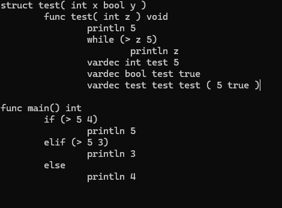
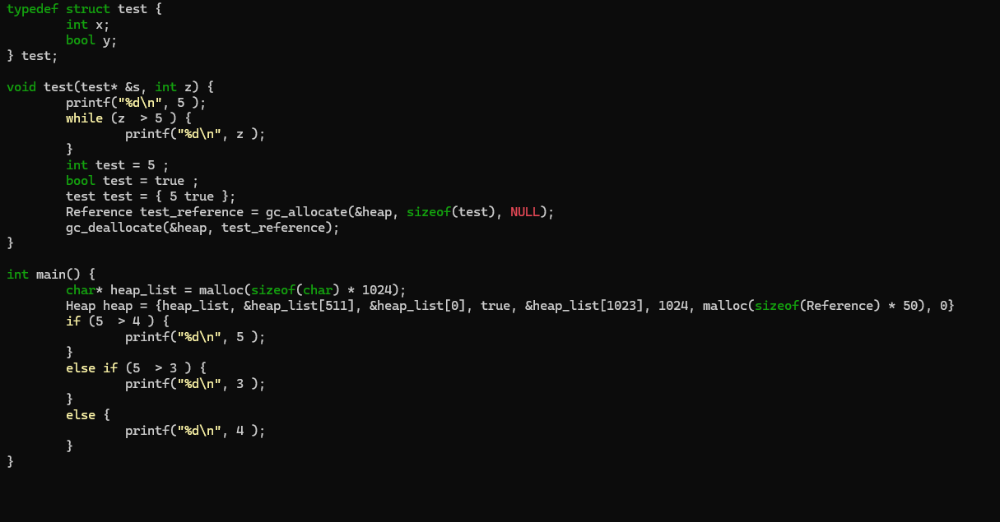
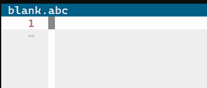
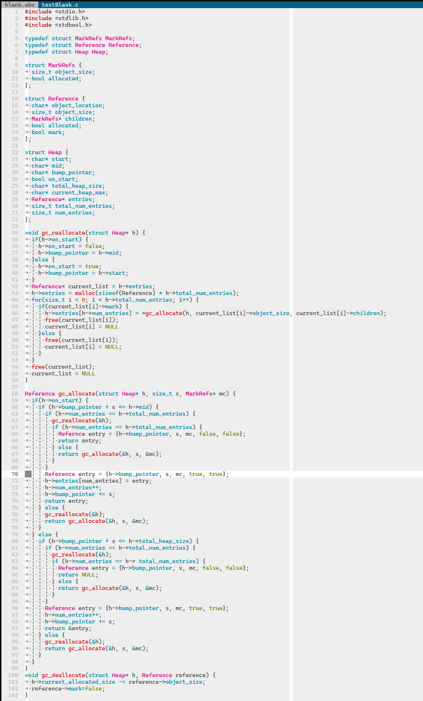
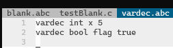
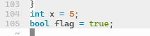
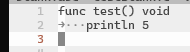
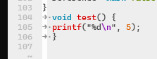
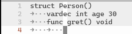
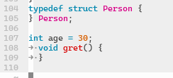

# ABCLang (Reclaimer Derivative)

## Why we chose Reclaimer?

We primarily chose Reclaimer becuase we wanted to learn garbage collecting. Further, we wanted to also learn a different language, rust, since it's pattern matching proved to be useful when designing and programming the compiler.

Now the difference between ABCLang and the original Reclaimer are the following:
- Reduced S-Expression Sytnax
  - ABCLang parses via indentation instead S-Expression, but some S-Expressions syntax still remain in ABCLang.
- Manual and Automatic Garbage Collecting
  - The User within ABCLang can force garbage collection in addition to garbage collection being automatic.
- Indentation are used in ABCLang

## Why use ABCLang?

ABCLang is ideal for the following userbase:
- Progammers transitioning from S-Expressions and non S-Expression syntax since ABCLang lies in between the two.
- Programmers who prefer a slightly higher level programming language since ABCLang allows for flexibility with memory management through its garbage collector.
- Programmers who like to manage memory within their programs since ABCLang offers manual garbage collecting if needed.

Overall, ABCLang is primarily designed for flexibility when it comes to memory management since the user has control on whether to depend on automatic garbage collecting, manual garbage collection, or both.


## Code Snippets

The following will be code snippets of the ABCLang:

### Ideal Composition for ABCLang

The following ABCLang code snippet contains practically everything about our language: Structs, Variable Declaration, While Loops, Branches, Garbage Collecting.


ABCLang: 




Output C Code:




### Compiling a blank file:




Output:

Upon comipling, the compiler will add all code regarding the garbage collector. Please note, **that all files will contain this** to avoid repetition I omitted this in the other images.



### Variable Declaration

Currently, only boolean and ints are allowed:



Output would be the following:



### Functions Calls

Example of a println statement:



Output:




### Structs

#### Incorrect Structs Variable Declaration

If variables are declared in a struct like the following:



Then the compiler assumes the user wants the function and variable otuside the body like so:




## Limitations

THERE IS NO TYPECHECKER!!!

If any error occurs regarding type checking, then the fault lies with the programmer. In other words, skill issue.

There is no block token, meaning code blocks (things in the curly braces) are not tokenizing correctly which leads to an error. A solution would be to use indentation.

Strings do not exist at all.

No main method is generated, unless the user specifies it as shown previously.

Further, the compiler doesn't check for file extensions. In other words, it will literally read anything (even if they don't use the `.abc` extension) and try to compile it.

Variable declaration must occur within the parameters of a struct, not in the body. Other wise you'd  get the following, where the structs variables are outside the body.


## Retrospective Edits

Remain more consitent with the S-Expressions since that would have made it easier to parse

## Running/Compiling the compiler

### Dependencies

Since ABCLang runs on rust, the user must have rust installed on their machine.

Rust can be downloaded here: [https://www.rust-lang.org/](https://www.rust-lang.org/)


Further, ABCLang outputs to the C language. If the user desires to run the C output file, then C must be installed onto their device.

C can be installed via GCC: [https://code.visualstudio.com/docs/cpp/config-mingw](https://code.visualstudio.com/docs/cpp/config-mingw)


### Setup and Running the Compiler
Since the compiler is written in rust, we used `cargo` to compile and test our compiler

First clone the repo:

`https://github.com/loganlang393/ABCLang.git`

Second, set your directory to `src`:

`cd src`

Third, make sure to build the compiler:

`cargo build`

Afterwards, use the following command:

`cargo run <input>.abc <output.c>`

The input should be an `.abc` file, and the output must be a `.c` file since the compiler output C code.

## Formal Syntax Definition

Syntax:
```
var is a variable
structname is the name of a structure
funcname is the name of a function
i is an integer

type ::= `int` | `bool` | Integers and booleans are types
         `void` |
         structname | Structures are a type

param :: = `(` type var `)`

Structs
structdef ::= `struct` structname `(` param* `)` `)`

Functions
fdef ::= `(` `func` funcname `(` param* `)` type stmt* `)`

Left-hand side.  Something we can assign to.
lhs ::= var | `(` `.` lhs var `)`

struct_param ::= `(` var exp `)`

exp ::= i | `true` | `false` | Integers and booleans
        `null` | Null; assignable to struct types
        lhs | Something we can access
        
        Allocate a new struct
        `(` structname `(` struct_param* `)` `)` |

        Function calls
        `(` funcname exp* `)`

stmt ::= `(` `vardec` type var exp `)` | Variable declaration
         `(` `=` lhs exp `)` | Assignment
         `(` `if` exp stmt [stmt] `)` | if
         `(` `while` exp stmt `)` | while
         `(` `println` exp `)` | Printing something
         `(` `return` [exp] `)` | Return
         `(` `stmt` exp `)` Expression statements

program ::= structdef* fdef* stmt* stmt* is the entry point
```
